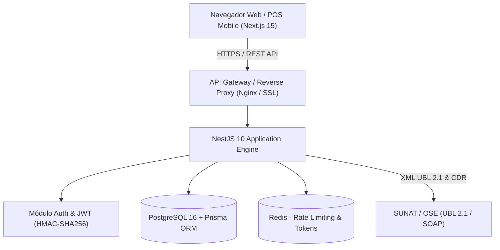

# Arquitectura del Sistema — Vivelite ERP

## 1. Visión General y Patrón Arquitectónico

Vivelite ERP es un sistema empresarial distribuido, desacoplado y orientado a dominios (Domain-Driven Design), diseñado para la gestión integral de plantas purificadoras, embotelladoras y distribuidoras de agua de mesa en Perú.

### Componentes Principales

1. **Frontend (Capa de Presentación)**
   - Framework: **Next.js 15 (App Router)** + **React 19** + **TypeScript**.
   - Estilizado y UI: **Tailwind CSS**, Lucide Icons, Shadcn-inspired responsive design.
   - Estado de servidor y sincronización: **TanStack React Query v5**.
   - Formularios y Validación: **React Hook Form** + **Zod**.

2. **Backend (Capa de Negocio y Servicios)**
   - Framework: **NestJS 10** + **Express** + **TypeScript**.
   - ORM y Persistencia: **Prisma ORM v5**.
   - Seguridad: **Passport.js**, **JWT**, **Bcrypt.js**, **Helmet**, **Throttler**, **Advisory Locking**.
   - Documentación OpenAPI: **Swagger / Scalar**.

3. **Base de Datos (Capa de Persistencia)**
   - Motor: **PostgreSQL 16**.
   - Aislamiento transaccional: **Read Committed** + **`pg_advisory_xact_lock`** para concurrencia atómica.
   - Precisión numérica: **`Decimal(10,2)`** estricto para valores monetarios y saldos.

---

## 2. Módulos del Backend

| Módulo | Responsabilidad Principal | Reglas Críticas |
| :--- | :--- | :--- |
| `Auth` | Autenticación, JWT, Refresh Tokens, RBAC | Hashing bcrypt (10 rounds), protección de fuerza bruta. |
| `Users` | Gestión de usuarios y perfiles | Protección contra auto-eliminación y eliminación del último SUPER_ADMIN. |
| `Customers` | Cartera de clientes, saldos de bidones y crédito | Control de deuda máxima (`creditLimit`), historial de compras. |
| `Products` | Catálogo de productos, SKU y categorías | Distinción de envases retornables (`isReturnable`). |
| `Inventory` | Kardex valorizado (PEPS/Promedio), stock y almacenes | No permite stock negativo, transacciones atómicas con Kardex. |
| `Sales` | Punto de venta (POS) y facturación | Bloqueo distribuido `pg_advisory_xact_lock`, validación de caja abierta. |
| `Orders` | Pedidos y ruteo para despachadores/drivers | Máquina de estados estricta, liquidación automática en entrega. |
| `Cash` | Cajas registradas, turnos y arqueos | Detección de sobrantes/faltantes, registro de ingresos/egresos. |
| `Payments` | Cobranzas de cuentas por cobrar (Créditos) | Cierre de deuda con bloqueo pesimista y actualización de saldo cliente. |
| `Sunat` | Facturación Electrónica UBL 2.1 | Generación de XML UBL 2.1 (Boleta/Factura/NC/ND), Hash SHA-256, QR. |
| `Dashboard` | Métricas operativas y financieras en tiempo real | Filtro de transacciones anuladas, cálculo de ingresos y préstamos de bidones. |
| `Audit` | Trazabilidad inmutable de operaciones | Registro de actor, IP, timestamp, entidad y payload anterior/nuevo. |

---

## 3. Concurrencia y Transaccionalidad

Para evitar condiciones de carrera (*Race Conditions*) en ventas concurrentes de POS y entregas simultáneas de repartidores sobre el mismo inventario:

1. **Locks Distribuidos a Nivel de Transacción:**
   - POS / Venta directa: `pg_advisory_xact_lock(424242)`
   - Pedidos / Entregas: `pg_advisory_xact_lock(424244)`
   - Pagos / Cobranzas: `pg_advisory_xact_lock(424245)`
2. **Atomicidad:**
   - La deducción de inventario, registro en Kardex, actualización de envases en poder del cliente, emisión de comprobante y movimiento de caja se ejecutan dentro de la misma transacción ACID (`prisma.$transaction`).
