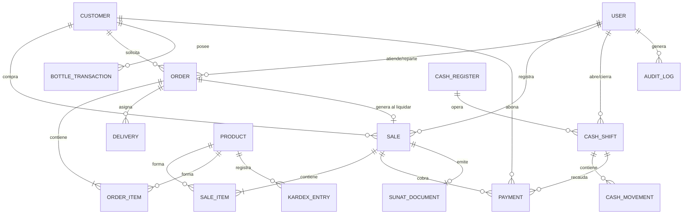

# Estructura y Diccionario de Datos — Vivelite ERP

## 1. Motor de Base de Datos
- **Motor:** PostgreSQL 16 (Compatible con PostgreSQL 14+)
- **ORM:** Prisma 5.22+
- **Precisiones:**
  - Valores monetarios: `Decimal(10, 2)`
  - Cantidades: `Int` / `Decimal(10, 2)`
  - Timestamps: `DateTime @default(now()) @db.Timestamptz(6)`

---

## 2. Diagrama de Entidad-Relación (ERD)

---

## 3. Tablas Principales

### `users`
- `id` (UUID, PK)
- `email` (VARCHAR 255, Unique)
- `password` (VARCHAR 255, Bcrypt hashed)
- `firstName`, `lastName` (VARCHAR 100)
- `role` (`SUPER_ADMIN`, `ADMIN`, `VENDEDOR`, `CAJERO`, `REPARTIDOR`, `SUPERVISOR`)
- `status` (`ACTIVE`, `INACTIVE`)
- `deletedAt` (Timestamptz, Soft delete)

### `customers`
- `id` (UUID, PK)
- `name` (VARCHAR 255)
- `documentType` (`DNI`, `RUC`, `CE`, `PASAPORTE`)
- `documentNumber` (VARCHAR 20, Unique)
- `bottlesHolding` (INT, default 0 - Cantidad de envases prestados)
- `currentDebt` (DECIMAL(10,2), default 0.00 - Saldo por cobrar)
- `creditLimit` (DECIMAL(10,2), default 0.00 - Límite de crédito)

### `products`
- `id` (UUID, PK)
- `sku` (VARCHAR 50, Unique)
- `name` (VARCHAR 255)
- `price` (DECIMAL(10,2))
- `costPrice` (DECIMAL(10,2))
- `stock` (INT)
- `minStock` (INT)
- `isReturnable` (BOOLEAN - Si es envase retornable de agua)

### `sales`
- `id` (UUID, PK)
- `saleNumber` (VARCHAR 50, Unique)
- `customerId` (UUID, FK -> customers)
- `sellerId` (UUID, FK -> users)
- `orderId` (UUID, Nullable, FK -> orders)
- `subtotal`, `tax`, `total` (DECIMAL(10,2))
- `paymentStatus` (`PAGADO`, `PENDIENTE`, `PARCIAL`, `ANULADO`)
- `saleType` (`DIRECTA_POS`, `PEDIDO_ENTREGA`)

### `sunat_documents`
- `id` (UUID, PK)
- `saleId` (UUID, Unique, FK -> sales)
- `documentType` (`BOLETA`, `FACTURA`, `NOTA_CREDITO`, `NOTA_DEBITO`)
- `series` (VARCHAR 4, ej. B001, F001)
- `number` (INT)
- `xmlHash` (VARCHAR 100, SHA-256)
- `sunatStatus` (`PENDIENTE`, `ENVIADO`, `ACEPTADO`, `RECHAZADO`, `ANULADO`)
- `cdrResponse` (TEXT, JSON o base64)

### `kardex`
- `id` (UUID, PK)
- `productId` (UUID, FK -> products)
- `movementType` (`ENTRADA_COMPRA`, `SALIDA_VENTA`, `AJUSTE_POSITIVO`, `AJUSTE_NEGATIVO`, `DEVOLUCION`, `ANULACION_VENTA`)
- `quantity` (INT)
- `unitCost`, `totalCost` (DECIMAL(10,2))
- `previousStock`, `newStock` (INT)
- `referenceDocument` (VARCHAR 100)

### `cash_shifts`
- `id` (UUID, PK)
- `cashRegisterId` (UUID, FK -> cash_registers)
- `openedById`, `closedById` (UUID, FK -> users)
- `initialBalance` (DECIMAL(10,2))
- `expectedBalance`, `actualBalance`, `difference` (DECIMAL(10,2))
- `status` (`ABIERTA`, `CERRADA`)

---

## 4. Estrategia de Indexación

- `idx_sales_created_at`: Filtros rápidos por rango de fecha en dashboard y reportes contables.
- `idx_sales_customer_id`: Búsquedas de cuenta corriente por cliente.
- `idx_orders_status`: Consulta en tiempo real de pedidos activos en tablero kanban.
- `idx_kardex_product_date`: Auditoría secuencial del Kardex valorizado.
