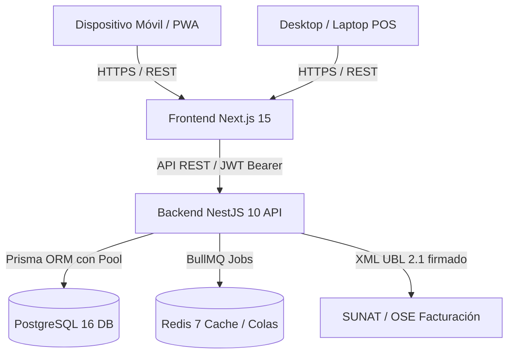

# Manual de Arquitectura, Operaciones y Entrega Técnica — Vivelite

## 1. Visión General del Sistema
**Vivelite** es una plataforma de software integral diseñada específicamente para distribuidoras de agua de mesa, control de inventario de envases retornables (bidones de policarbonato), gestión de clientes corporativos y residenciales, punto de venta (POS) en tiempo real con apertura y cierre de caja, facturación electrónica para Perú (SUNAT/OSE) y logística de despacho en ruta.

---

## 2. Arquitectura de Software



### Componentes Tecnológicos:
- **Frontend**: Next.js 15.1, React 19, Tailwind CSS, TanStack Query v5, Lucide React.
  - Diseño responsive dual: Barra de navegación táctil fija en móvil (`Bottom Navigation` con `pb-safe`) y Sidebar lateral expandible en Desktop.
  - Control de desbordamiento horizontal garantizado con `overflow-x-hidden` y tablas con contenedor de desplazamiento horizontal exclusivo (`overflow-x-auto`).
- **Backend**: NestJS 10, TypeScript 5, Prisma ORM, Passport JWT, Helmet, Cookie-Parser, Class-Validator.
  - Concurrencia y consistencia atómica mediante Bloqueos Asesores a Nivel de Transacción de PostgreSQL (`pg_advisory_xact_lock(424242)`).
  - Manejo integral de excepciones centralizado (`AllExceptionsFilter`).
- **Persistencia**: PostgreSQL 16 con índices optimizados, claves foráneas en cascada/restrict y logs de auditoría inmutables (`AuditLog`).
- **Caché y Colas**: Redis 7 para sesiones, colas BullMQ y throttling.

---

## 3. Matriz de Roles y Permisos (RBAC)

| Módulo / Recurso | SUPER_ADMIN | ADMIN | VENDEDOR | CAJERO | REPARTIDOR | ALMACENERO | SUPERVISOR |
| :--- | :---: | :---: | :---: | :---: | :---: | :---: | :---: |
| **Punto de Venta (POS / Ventas)** | Total | Total | Operar | Operar | - | - | Consultar |
| **Control de Caja (Turnos / Arqueo)** | Total | Total | Abrir/Cerrar | Abrir/Cerrar | - | - | Auditar |
| **Clientes (CRUD / Créditos)** | Total | Total | Crear/Editar | Consultar | Consultar | - | Consultar |
| **Inventario & Kardex** | Total | Total | Consultar | - | - | Operar | Auditar |
| **Control de Envases / Bidones** | Total | Total | Registrar | Registrar | Registrar | Registrar | Consultar |
| **Facturación Electrónica (SUNAT)**| Total | Total | Emitir | Emitir | - | - | Consultar |
| **Pedidos y Despacho en Ruta** | Total | Total | Crear | Consultar | Entregar | - | Consultar |
| **Importación Masiva Excel** | Total | Total | - | - | - | - | - |
| **Configuración del Sistema** | Total | Total | - | - | - | - | - |

---

## 4. Procedimientos de Respaldo y Recuperación (Disaster Recovery)

### 4.1 Respaldo Automatizado
Se dispone de scripts nativos en `scripts/`:
- **Linux/Docker**: `bash scripts/backup-db.sh`
- **Windows PowerShell**: `powershell -File scripts/backup-db.ps1`

Ambos scripts ejecutan un `pg_dump` con formato de limpieza (`--clean --if-exists`), compresión gzip y política de retención automática de 30 días.

### 4.2 Restauración de Respaldo
Para restaurar una copia de seguridad en un entorno recuperado:
```bash
# 1. Descomprimir el respaldo si está en formato .gz
gzip -d backups/backup_vivelite_db_YYYYMMDD_HHMMSS.sql.gz

# 2. Restaurar hacia la base de datos de producción
docker exec -i vivelite_postgres psql -U vivelite_user -d vivelite_db < backups/backup_vivelite_db_YYYYMMDD_HHMMSS.sql
```

---

## 5. Guía de Despliegue en Producción

### Prerrequisitos de Servidor:
- Linux Ubuntu 22.04 LTS o Debian 12 (mínimo 2 vCPU, 4GB RAM, 40GB SSD).
- Docker Engine >= 24.0 & Docker Compose v2.
- Dominio con registros DNS apuntando a la IP pública (ej. `app.vivelite.pe`, `api.vivelite.pe`).
- Certificados SSL emitidos (Let's Encrypt / Certbot / Cloudflare).

### Pasos de Despliegue:
1. Clonar repositorio en `/opt/vivelite`.
2. Configurar variables de producción en `.env` (utilizando `.env.example` como plantilla):
   - Generar JWT Secrets criptográficamente seguros (`openssl rand -base64 32`).
   - Definir contraseñas seguras para PostgreSQL y Redis.
   - Configurar credenciales de Facturación Electrónica SUNAT (SOL usuario, clave, certificado .pfx).
3. Levantar servicios de base de datos y cache:
   ```bash
   docker compose up -d
   ```
4. Ejecutar migraciones de Prisma:
   ```bash
   cd backend && pnpm install --frozen-lockfile && npx prisma migrate deploy
   ```
5. Compilar backend y frontend:
   ```bash
   pnpm --dir backend build
   pnpm --dir frontend build
   ```
6. Iniciar procesos bajo PM2 o Docker Swarm/Kubernetes.

---

## 6. Monitoreo y Mantenimiento Post-Entrega

- **Health Check Endpoint**: `GET /api/v1/health` (Valida conexión activa a PostgreSQL y Redis).
- **Métricas y Logs**:
  - Backend NestJS reporta incidentes no capturados mediante `AllExceptionsFilter` con stack traces en consola y logs rotativos.
  - Auditoría de usuario registrada en tabla `AuditLog` para cualquier modificación sensible.
