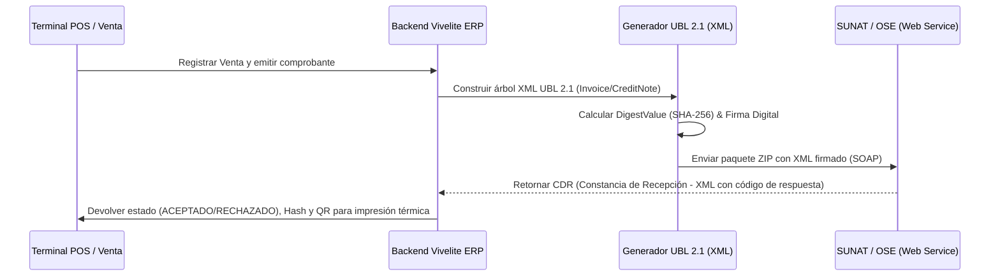

# Facturación Electrónica SUNAT — Estándar UBL 2.1

## 1. Arquitectura de Comprobantes Electrónicos

El sistema Vivelite ERP cumple con las resoluciones de SUNAT (Resolución de Superintendencia N.° 097-2012/SUNAT y modificatorias) para la emisión y validación de Comprobantes de Pago Electrónicos (CPE) bajo el estándar **UBL 2.1**.



---

## 2. Tipos de Comprobantes Soportados

| Código SUNAT | Tipo de Documento | Serie Estándar | Requisitos de Receptor |
| :--- | :--- | :--- | :--- |
| `01` | Factura Electrónica | `F001` - `F999` | RUC válido (11 dígitos), Razón Social activa y habida. |
| `03` | Boleta de Venta Electrónica | `B001` - `B999` | DNI (8 dígitos) o Venta a Consumidor Final (< S/ 700.00). |
| `07` | Nota de Crédito Electrónica | `FC01` / `BC01` | Referencia obligatoria a comprobante origen y motivo catálogo 09. |
| `08` | Nota de Débito Electrónica | `FD01` / `BD01` | Referencia obligatoria a comprobante origen y motivo catálogo 10. |

---

## 3. Estructura del Código QR y Hash

De acuerdo con el Anexo V de la R.S. 097-2012/SUNAT, la cadena para el código QR impreso en el ticket térmico debe tener la siguiente estructura concatenada por barras verticales (`|`):

```text
RUC Emisor | Tipo Documento | Serie | Correlativo | IGV | Total | Fecha Emisión (YYYY-MM-DD) | Tipo Doc Receptor | Num Doc Receptor | Valor Resumen (Hash SHA-256) |
```

### Ejemplo:
```text
20601234567|03|B001|00001234|3.05|20.00|2026-10-03|1|71234567|a8f5c9e...|
```

---

## 4. Leyenda y Monto en Letras

Todo comprobante incluye el tag UBL `<cbc:Note languageLocaleID="1000">SON VEINTE CON 00/100 SOLES</cbc:Note>` generado automáticamente mediante el algoritmo de conversión en español.
